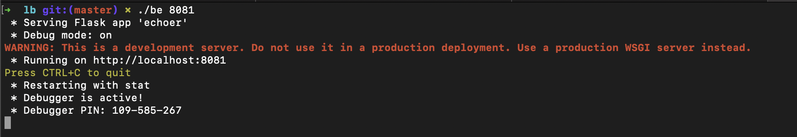
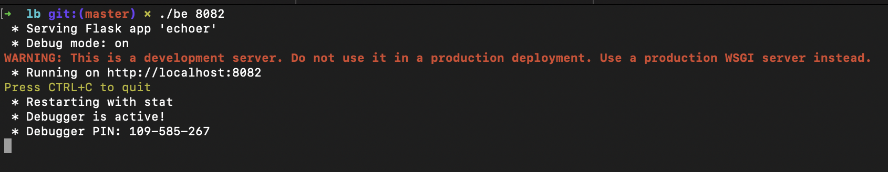
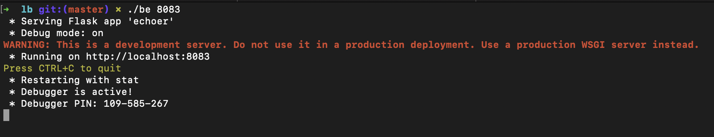
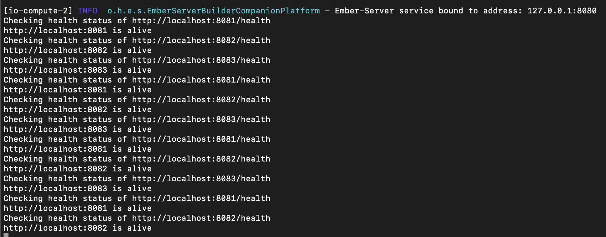
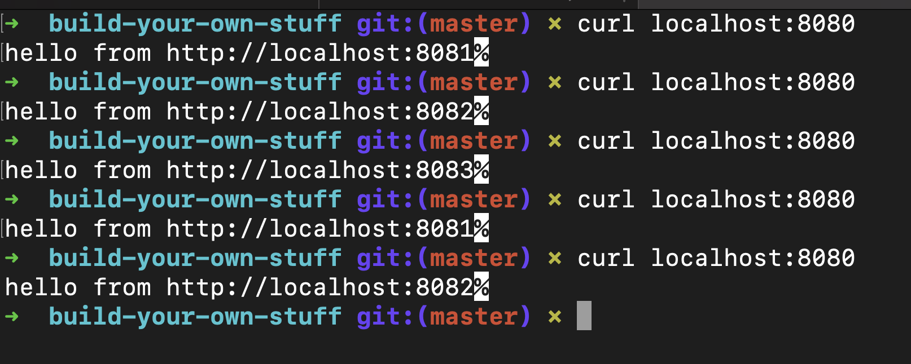
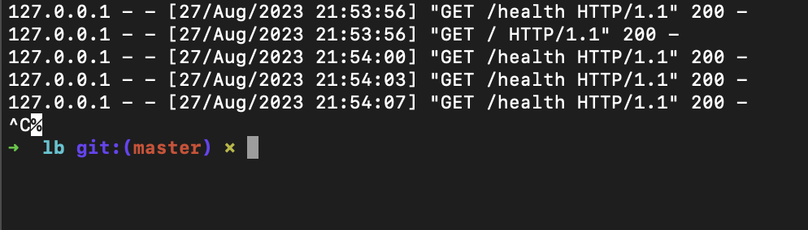
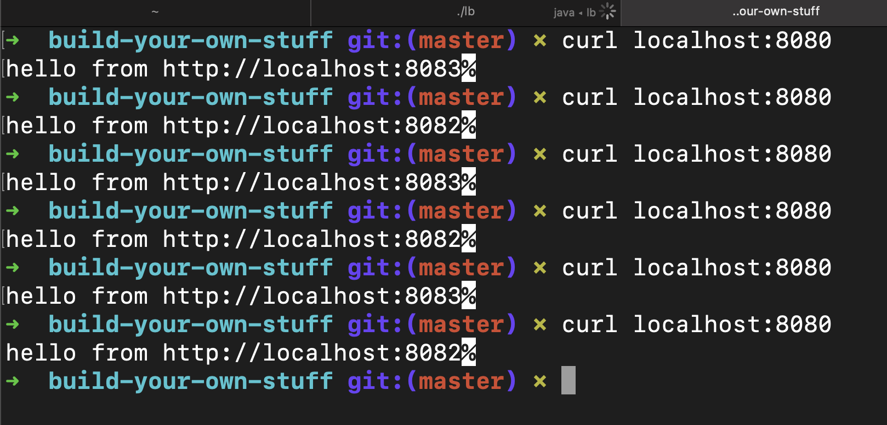
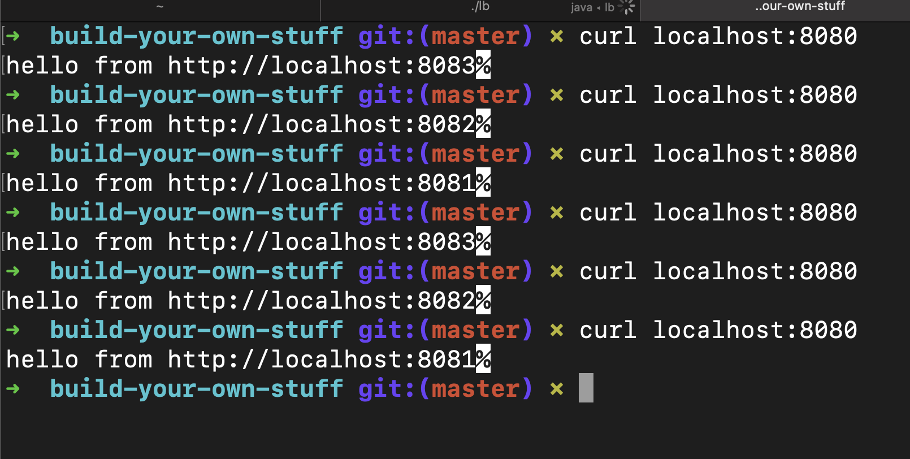

# In progress

Current implementation uses round robin logic for distributing requests.

Also, it periodically checks the health of servers and if one of them is dead it stops sending requests to it.

As soon as dead server's back up and running it will start sending requests to it.

Comprehensive testing instructions:

Configure load balancer in `src/main/resources/application.conf`:

Run a few backends on different ports:
- `./be 8081`

- `./be 8082`

- `./be 8083`

Run the load balancer and observe health check logs:
- `./lb`

Ping the load balancer and observe responses from different servers:
- `curl localhost:8080`

Stop one of the backends (8081):

Observe the load balancer adjust distributing requests to only two servers:

Run the server with port 8081 again:
- `./be 8081`

Observe the load balancer adjust distributing requests to all three servers again:
- `curl localhost:8080`
