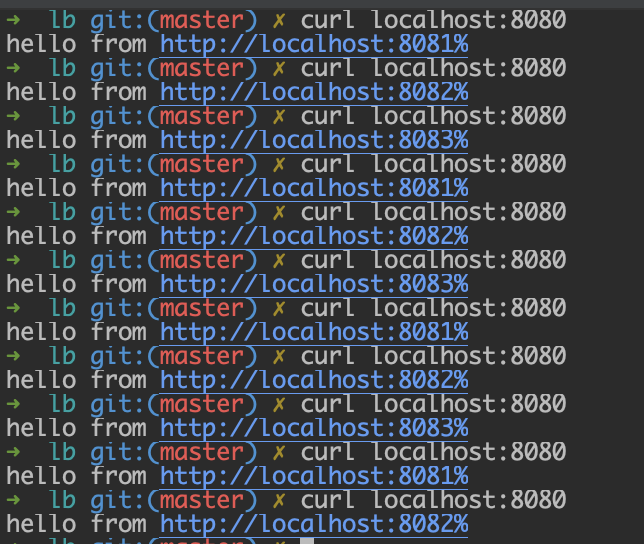

# In progress

Current implementation uses round robin logic for distributing requests.
Also, it periodically checks the health of servers and if one of them is dead it stops sending requests to it.
As soon as dead server's back up and running it will start sending requests to it.

For testing locally:

start the load balancer:
- `./lb`

run a few backends on different ports:
- `./be 8081`
- `./be 8082`
- `./be 8083`

observe output:

